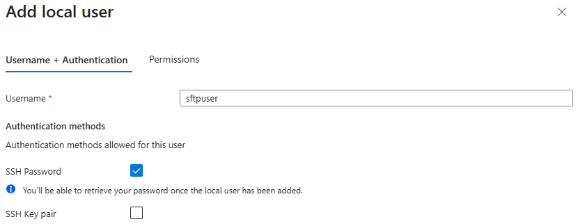
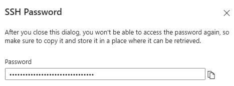
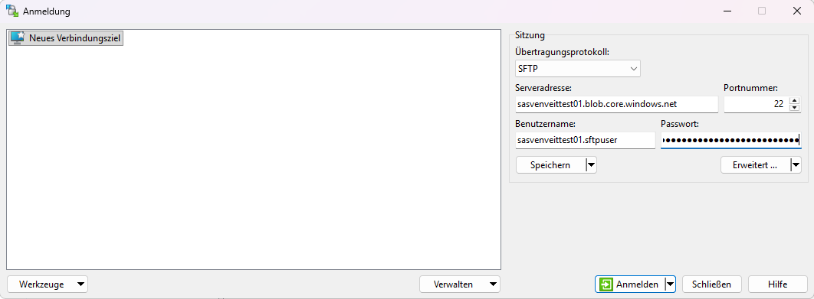

# Azure Storage SFTP – Configure a Local User (Password Authentication)

## Overview

Azure Storage SFTP supports authentication using **Local Users** with an SSH password.

This guide explains how to:

- Create a Local User
- Configure password authentication
- Assign container permissions
- Configure the Home Directory
- Save the generated password
- Verify the created user

> **Prerequisite**
>
> An Azure Storage Account with SFTP enabled must already exist.
>
> See: **Azure Storage Account – Configure SFTP**

---

## Prerequisites

Before continuing, ensure that:

- Azure Storage SFTP is enabled.
- A Blob Container already exists.
- You have permission to manage Local Users.

---

# Step-by-Step Guide

---

## Step 1 – Open the SFTP Management Page

Navigate to:

```text
Storage Account
→ Settings
→ SFTP
```

Select **Add local user**.


---

## Step 2 – Configure Username and Authentication

Enter a username for the Local User.

Enable:

- ✅ SSH Password

Disable:

- ☐ SSH Key pair

Example:

```text
sftpuser
```



> **Note**
>
> Password authentication is suitable for applications or users that cannot authenticate using SSH key pairs.

---

## Step 3 – Configure Container Permissions

Select the Blob Container the user should access.

Example:

```text
transfer
```

Assign the required permissions.

Typical permissions include:

| Permission | Description |
|------------|-------------|
| Read | Download files |
| Create | Upload new files |
| Write | Modify existing files |
| Delete | Delete files |
| List | List directory contents |

Configure the **Home (landing) directory**.

Example:

```text
transfer
```


### Optional ACL Settings

The ACL settings are only required for advanced Azure Data Lake Storage Gen2 scenarios.

For most SFTP deployments:

- Keep the automatically assigned **User ID**
- Leave **Group ID** empty
- Leave **Allow ACL authorization** disabled

> **Note**
>
> Container permissions are sufficient for typical SFTP workloads.

---

## Step 4 – Save the Generated Password

After selecting **Add**, Azure automatically generates an initial password.

The password is displayed only once.

Copy and store it securely before closing the dialog.



> **Important**
>
> If the password is lost, it cannot be viewed again.
> Instead, a new password must be generated.

---

## Step 5 – Verify the Local User

Verify:

- Username
- Authentication method
- Home Directory
- Container permissions

The username shown in Azure is **not** the complete username used during authentication.

Use the **Connection string** displayed in the SFTP overview as the username.

Example:

```text
sasvenveittest01.sftpuser@sasvenveittest01.blob.core.windows.net
```


---

## Step 6 – Connect using WinSCP

Open **WinSCP** and create a new SFTP connection.

Configure the following settings:

| Setting | Value |
|---------|-------|
| File protocol | `SFTP` |
| Host name | `<storage-account-name>.blob.core.windows.net` |
| Port number | `22` |
| User name | Use the **username** from the Azure SFTP connection string (the part before `@`) |
| Password | The password generated during Local User creation |

Example:

| Setting | Value |
|---------|-------|
| Host name | `sasvenveittest01.blob.core.windows.net` |
| User name | `sasvenveittest01.sftpuser` |
| Password | Generated Azure SFTP password |

After entering the connection details, select **Login**.



> **Note**
>
> The username used for authentication is the **Connection string** displayed in Azure, **not** only the Local User name.

# Next Steps

The Local User has now been configured.

To connect to Azure Storage SFTP, continue with:

- **WinSCP – Connect to Azure Storage using Password Authentication**

---

# Security Considerations

- Store generated passwords securely.
- Grant only the permissions required by the user.
- Create separate Local Users for different applications or users.
- Consider using **SSH Public Key Authentication** instead of passwords where possible.

---

# Related Articles

- Azure Storage Account – Configure SFTP
- Azure Storage SFTP – Configure a Local User (SSH Key Authentication)
- WinSCP – Connect to Azure Storage using Password Authentication
