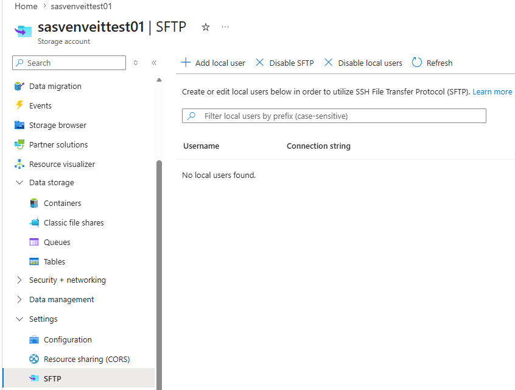
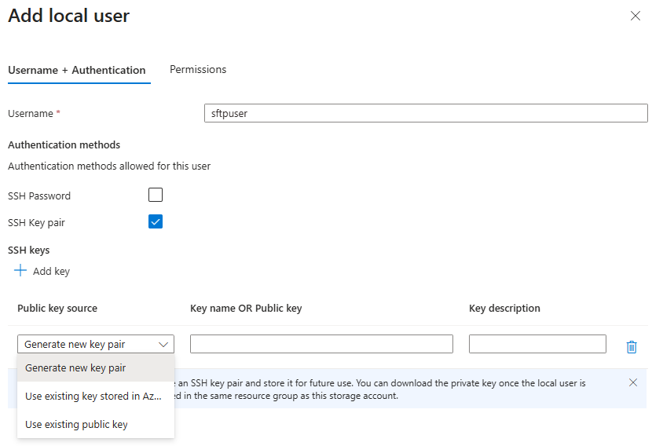
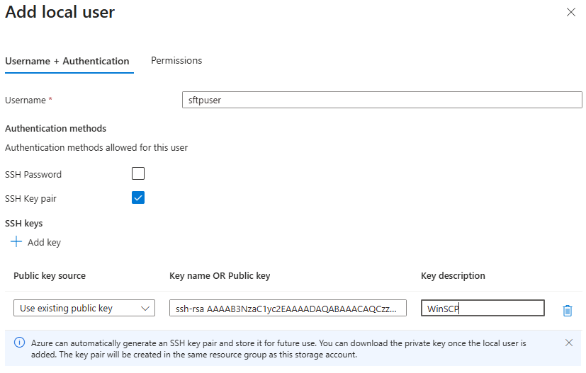
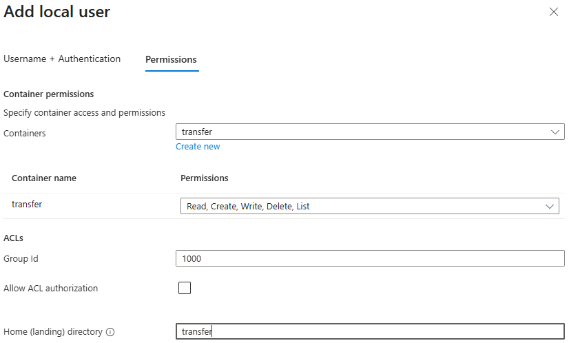
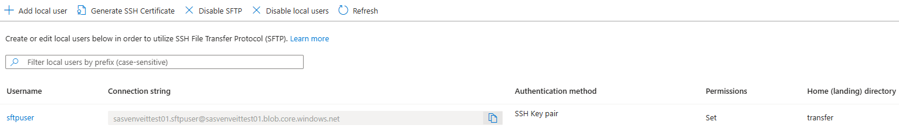
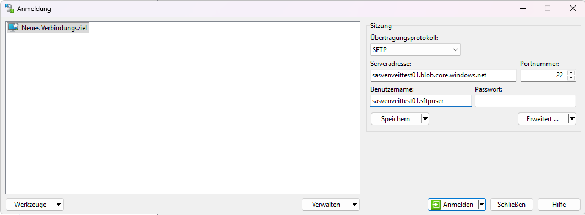
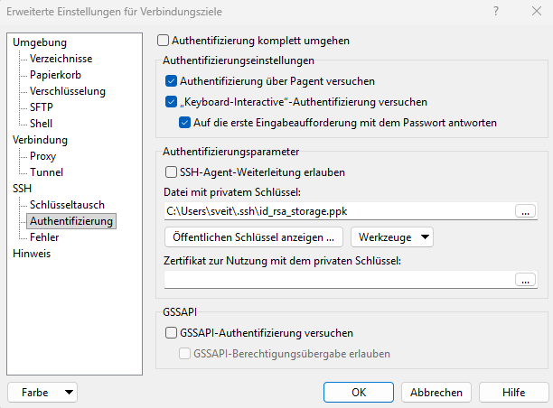

# Azure Storage SFTP – Configure a Local User (SSH Key Authentication)

## Overview

Azure Storage SFTP supports authentication using SSH public keys instead of passwords.

With SSH key authentication, the **public key** is uploaded to Azure Storage, while the **private key** remains securely stored on the client device. During authentication, Azure verifies that the client owns the corresponding private key without transmitting it over the network.

This guide explains how to:

- Create an SFTP local user
- Configure SSH key authentication
- Upload an existing SSH public key
- Assign container permissions
- Verify the created user

---

## Prerequisites

Before continuing, ensure that:

- Azure Storage SFTP is enabled
- A Blob Container already exists
- An SSH key pair has already been generated

Related articles:

- SSH Key Generation (ED25519)
- SSH Key Generation (RSA)
- Azure Storage Account – Configure SFTP

> **Important**
>
> At the time of writing, Azure Storage SFTP does not support **ED25519** public keys for Local User authentication.
>
> If you plan to use SSH key authentication with Azure Storage SFTP, generate an **RSA (4096-bit)** key pair instead.

---

# Step-by-Step Guide

## Step 1 – Open the SFTP Configuration

Open your Azure Storage Account and navigate to:

```text
Storage Account
→ Settings
→ SFTP
→ Add local user
```

The SFTP page displays all configured local users.



---

## Step 2 – Configure the Local User

Enter a username for the SFTP user.

Under **Authentication methods**, enable:

- SSH Key pair

Leave **SSH Password** disabled if you only want to allow key-based authentication.



> **Note**
>
> Azure Storage supports:
>
> - Password authentication
> - SSH key authentication
> - Both authentication methods simultaneously

---

## Step 3 – Upload the SSH Public Key

Click **Add key**.

For an existing SSH key pair select:

```text
Use existing public key
```

Paste the contents of your **public key** into the **Key name OR Public key** field.

Optionally enter a description to help identify the key later.

Example:

```powershell
Get-Content $HOME\.ssh\id_ed25519.pub
```

or

```powershell
Get-Content $HOME\.ssh\id_rsa.pub
```

Copy the complete output and paste it into Azure.



> **Important**
>
> Upload **only** the public key (`*.pub`).
>
> Never upload or share your private key.

---

## Step 4 – Configure Container Permissions

Switch to the **Permissions** tab.

Select the Blob Container that should be accessible via SFTP.

Typical permissions include:

| Permission | Description |
|------------|-------------|
| Read | Download files |
| Create | Upload new files |
| Write | Modify existing files |
| Delete | Delete files |
| List | List directory contents |

Configure the **Home Directory** to point to the Blob Container.

Example:

```text
transfer
```



### Optional ACL Settings

The ACL settings are only required for advanced scenarios using **Azure Data Lake Storage Gen2 (Hierarchical Namespace)** with POSIX-style access control.

| Setting | Description |
|----------|-------------|
| **User ID (UID)** | Numeric identifier assigned to the local user. |
| **Group ID (GID)** | Numeric identifier of the user's primary group. |
| **Allow ACL authorization** | Enables authorization using Azure Data Lake Storage ACLs instead of relying only on container permissions. |

> **Note**
>
> For most SFTP deployments these settings can remain unchanged. Container permissions are sufficient for typical file transfer scenarios.

> **Tip**
>
> Follow the Principle of Least Privilege and grant only the permissions required by the workload.

---

## Step 5 – Create the Local User

After reviewing the configuration, create the local user.

The user will appear in the SFTP overview.

The **Authentication method** should display:

```text
SSH Key pair
```



This confirms that the user has been successfully configured for SSH key authentication.

---

## Step 6 – Configure WinSCP

Open **WinSCP** and create a new SFTP connection.

Configure the following settings:

| Setting | Value |
|---------|-------|
| File protocol | `SFTP` |
| Host name | `<storage-account-name>.blob.core.windows.net` |
| Port number | `22` |
| User name | Use the **username** contained in the Azure SFTP connection string (the part before `@`) |
| Password | Leave empty |

Example:

| Setting | Value |
|---------|-------|
| Host name | `sasvenveittest01.blob.core.windows.net` |
| User name | `sasvenveittest01.sftpuser` |



> **Note**
>
> The username used for authentication is the **username** contained in the Azure SFTP connection string (the part before `@`), **not** only the Local User name.

---

## Step 7 – Select the Private Key

Select **Advanced...**.

Navigate to:

```text
SSH
→ Authentication
```

Under **Private key file**, browse to your private SSH key.

If you generated your key using OpenSSH, WinSCP automatically offers to convert it into the required PuTTY (`.ppk`) format.

Select the generated `.ppk` file and confirm the dialog.



> **Note**
>
> The private key always remains on your local computer.
> Only the corresponding public key is uploaded to Azure Storage.

## Step 8 – Connect to Azure Storage

Return to the login dialog and select **Login**.

If prompted, accept the server host key.

After successful authentication, the Blob Container configured as the **Home Directory** is displayed.

The SFTP connection is now ready for file transfers.

---

## Result

You have successfully:

- Created an Azure Storage SFTP Local User
- Configured SSH key authentication
- Uploaded an SSH public key
- Assigned container permissions
- Connected successfully to Azure Storage SFTP using WinSCP

You can now securely upload and download files using SFTP and SSH key authentication.

---

# Security Best Practices

- Upload only the **public key**.
- Never disclose or share the private key.
- Store the private key securely.
- Protect the private key with a passphrase whenever possible.
- Prefer **ED25519** for modern environments.
- Use **RSA** only when compatibility with legacy systems is required.
- Use separate SSH key pairs for different environments whenever possible.

---

# Troubleshooting

## Authentication fails

Verify that:

- the correct public key has been uploaded to the Local User
- the corresponding private key is selected in WinSCP
- the username is correct (the part before `@` in the Azure SFTP connection string)
- the Host name matches the Azure Storage Account endpoint

---

## Private key cannot be selected

If your private key is in the OpenSSH format, allow WinSCP to convert it automatically to the required PuTTY (`.ppk`) format.

---

## Permission denied

Verify that:

- the required container permissions have been assigned
- the Home Directory points to the correct Blob Container
- the uploaded public key matches the selected private key

---

# Related Articles

- Azure Storage Account – Configure SFTP
- Azure Storage SFTP – Configure a Local User (Password Authentication)
- SSH Key Generation (ED25519)
- SSH Key Generation (RSA)
