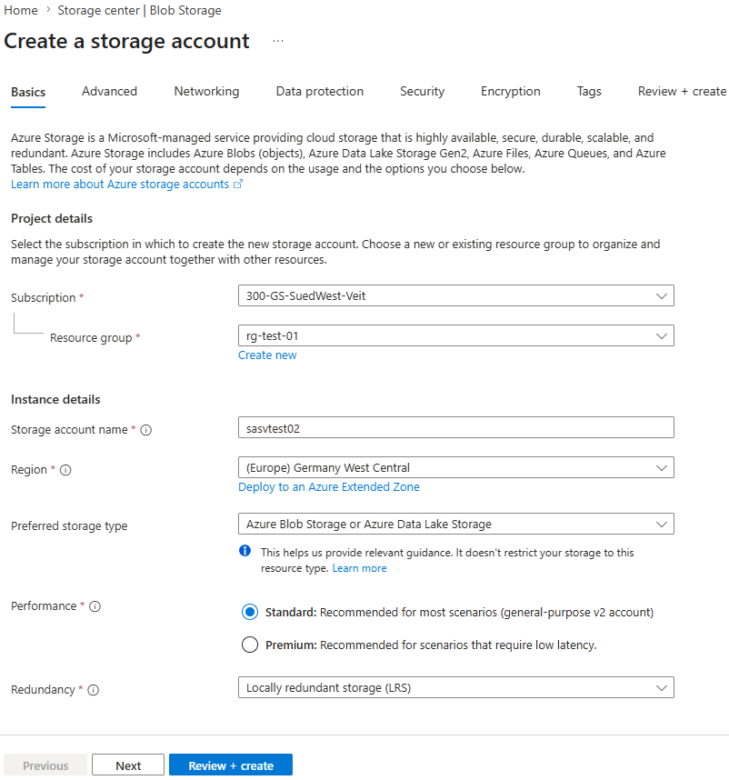
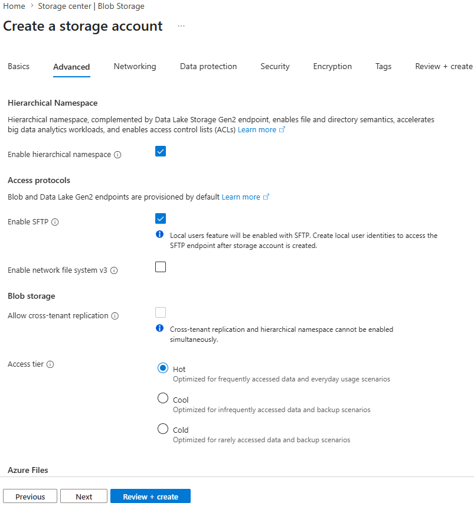
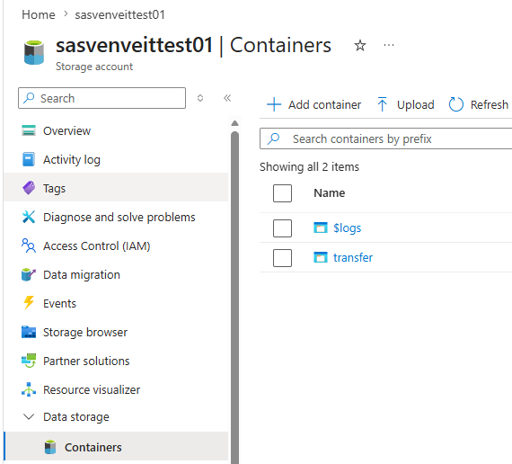
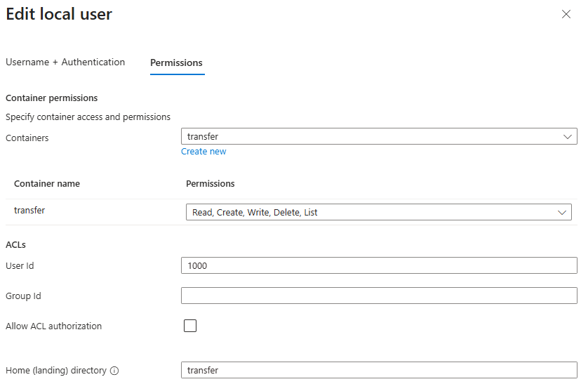
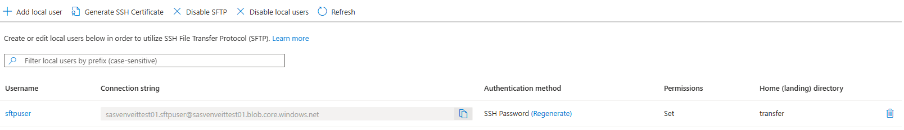

# Azure Storage Account – Configure SFTP

## Overview

Azure Blob Storage supports secure file transfers using the **SSH File Transfer Protocol (SFTP)**.

By enabling SFTP on an Azure Storage Account, users can securely upload and download files without exposing Storage Account access keys or relying on SMB or traditional FTP services.

This guide explains how to:

- Create an Azure Storage Account for SFTP
- Enable the required Storage Account features
- Create a Blob Container
- Configure a Local User
- Assign container permissions
- Verify the SFTP configuration

> **Note**
>
> Azure SFTP uses **Local Users** for authentication. These users are independent of Microsoft Entra ID accounts.

---

## Prerequisites

Before starting, ensure that:

- You have an Azure subscription.
- You have permission to create Azure Storage Accounts.
- The Storage Account will use **Standard** performance.
- A supported redundancy option (for example **LRS**) is selected.
- SFTP will be enabled during Storage Account creation.

---

# Step-by-Step Guide

---

## Step 1 – Create the Storage Account

Create a new Azure Storage Account.

Recommended settings:

| Setting | Value |
|---------|-------|
| Performance | Standard |
| Redundancy | Locally Redundant Storage (LRS) |
| Storage Type | Azure Blob Storage |
| Region | As required |



---

## Step 2 – Enable Hierarchical Namespace and SFTP

Open the **Advanced** tab during Storage Account creation.

Enable the following options:

- ✅ Enable hierarchical namespace
- ✅ Enable SFTP

The **Hierarchical Namespace** is required because Azure SFTP is built on **Azure Data Lake Storage Gen2**.

Without enabling this feature, SFTP cannot be used.



---

## Step 3 – Create a Blob Container

After the Storage Account has been deployed, create a Blob Container.

The container stores all files uploaded through SFTP and can also serve as the user's **Home Directory**.

Example:

```text
transfer
```



---

## Step 4 – Open the SFTP Management Page

Navigate to:

```text
Storage Account
→ Settings
→ SFTP
```

The SFTP management page allows you to:

- Create Local Users
- Manage existing users
- Enable or disable SFTP
- Generate SSH certificates


---

## Step 5 – Create a Local User

Select **Add local user**.

Configure:

- Username
- Authentication method

Azure supports the following authentication methods:

- SSH Password
- SSH Public Key
- Both methods simultaneously


---

## Step 6 – Configure Container Permissions

Assign the required permissions for the Blob Container.

Typical permissions include:

| Permission | Description |
|------------|-------------|
| Read | Download files |
| Create | Upload new files |
| Write | Modify existing files |
| Delete | Delete files |
| List | List directory contents |

Configure the **Home Directory** to point to the Blob Container created earlier.

Example:

```text
transfer
```



> **Tip**
>
> Grant only the permissions required for the intended workload (Principle of Least Privilege).

---

## Step 7 – Save the Generated Password

If **SSH Password** authentication is selected, Azure automatically generates an initial password.

The password is displayed **only once**.

Copy and securely store it before closing the dialog.


> **Important**
>
> After closing the dialog, the password cannot be viewed again. If it is lost, a new password must be generated.

---

## Step 8 – Verify the Local User

After the Local User has been created, verify:

- Username
- Authentication method
- Home Directory
- Container permissions

The username displayed in Azure is **not** the complete username used for SFTP authentication.

Use the following format when connecting:

```text
<storage-account-name>.<local-user>
```

Example:

```text
sasvenveittest01.sftpuser
```



---

# Security Considerations

- Prefer **SSH Public Key Authentication** whenever possible.
- Store generated passwords securely.
- Grant only the permissions required by the user.
- Create separate Local Users for different applications or users.
- Use dedicated Blob Containers to isolate user data when appropriate.

---

# Related Articles

- SSH Key Generation (ED25519)
- SSH Key Generation (RSA)
- WinSCP – Connect to Azure Storage using Password Authentication
- WinSCP – Connect to Azure Storage using SSH Key Authentication
