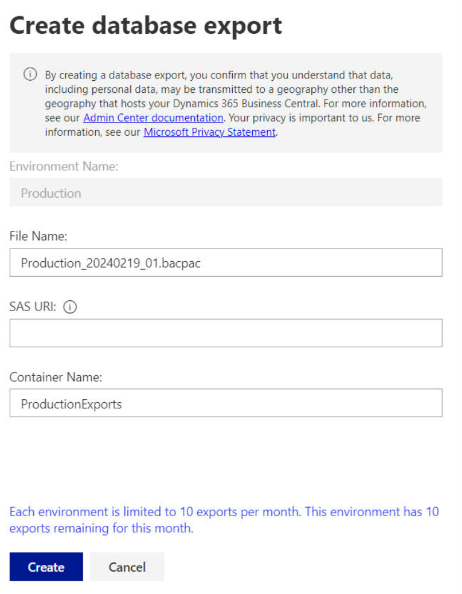
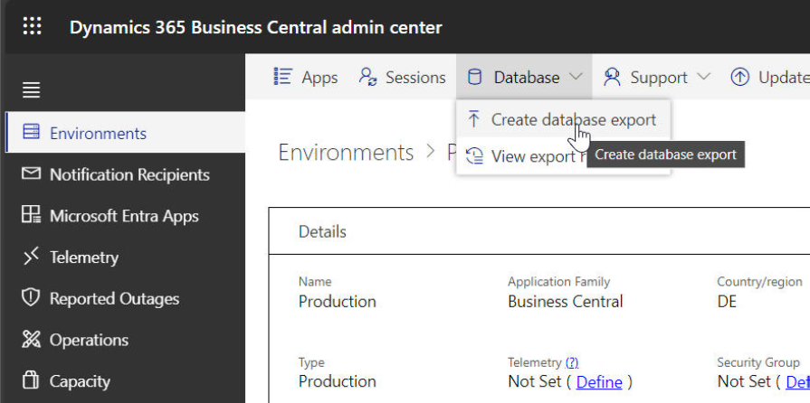
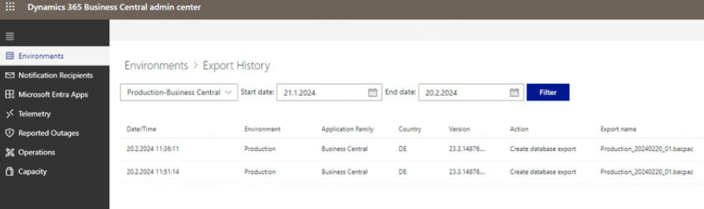

# Business Central SaaS – Database Export to Azure Storage

## Overview

Microsoft Dynamics 365 Business Central (SaaS) includes a built-in backup strategy that automatically protects production databases. In addition to Microsoft's managed backups, Business Central provides the option to manually export the production database to an Azure Storage Account as a **BACPAC** file.

This article explains:

- How Business Central automatically protects production databases
- The difference between Microsoft's managed backups and manual database exports
- Limitations and prerequisites for database exports
- How to export a Business Central database to Azure Storage
- Available automation options
- Ways to access the exported database
- Disaster recovery considerations

---

# Continuous Backup

Business Central Online automatically protects production databases by using the continuous backup capabilities of Azure SQL Database.

Backups are fully managed by Microsoft and require no additional configuration by the customer.

## Backup Schedule

Microsoft automatically creates the following backups:

| Backup Type | Frequency |
|-------------|-----------|
| Full Backup | Weekly |
| Differential Backup | Every 12 or 24 hours |
| Transaction Log Backup | Approximately every 10 minutes |

Backups are automatically retained for **30 days**.

For more information about the underlying backup mechanism, see:

- Automatic geo-redundant backups (Azure SQL Database)
  - https://learn.microsoft.com/azure/azure-sql/database/automated-backups-overview

> **Important**
>
> Customers and administrators do **not** have direct access to the backup infrastructure. Backup creation, storage and retention are fully managed by Microsoft.

---

## Restore Options

Business Central environments can be restored through the **Business Central Admin Center**.

The following restore scenarios are supported:

| Source Environment | Restore Target |
|--------------------|----------------|
| Production | Production or Sandbox |
| Sandbox | Sandbox only |

A Business Central environment can be restored **up to 10 times per month**.

For detailed information and current limitations, see Microsoft's documentation:

- Restore Business Central environments
  - https://learn.microsoft.com/dynamics365/business-central/dev-itpro/administration/tenant-admin-center-environments

Business Central also provides APIs for restore operations through the Admin Center.

---

# Database Export

Besides Microsoft's managed backup strategy, Business Central also supports **manual database exports**.

Unlike Microsoft's automatic backups, a database export is stored in **your own Azure Storage Account**, giving you full control over storage, retention and further processing.

The export is generated directly from the Business Central online environment and stored as a **BACPAC** file.

Typical use cases include:

- Long-term archive storage
- External backup copies
- Migration scenarios
- Test and development environments
- Import into SQL Server
- Docker-based Business Central environments

Unlike the managed backup service, the exported BACPAC file remains available in your own Azure Storage Account until it is deleted according to your retention strategy.

# Export Limitations

Before creating a database export, be aware of the following limitations:

- Only **Production** environments can be exported.
- A maximum of **10 database exports per month** is allowed for each environment.
- The remaining number of available exports is displayed in the **Business Central Admin Center**.
- Every export is listed in the **Export History**.
- The export process is subject to the technical limitations of Azure SQL Database BACPAC exports.

For more information:

- BACPAC Exports – Azure SQL Database & Azure SQL Managed Instance
  - https://learn.microsoft.com/azure/azure-sql/database/database-export

> **Important**
>
> A **BACPAC** file contains only the Business Central database.
>
> It **does not** include the complete Business Central application, extensions, service tier or server configuration.

Therefore, a BACPAC export **cannot be used to recreate a complete Business Central On-Premises environment** without additional installation and configuration steps.

However, the exported database can be used for:

- SQL Server import
- Migration scenarios
- Docker-based Business Central environments
- Re-import into a Business Central Cloud environment (after preparing an On-Premises environment)

---

## Prerequisites

Before starting the export, ensure the following prerequisites are met:

- Azure Subscription
- Azure Storage Account
- Blob Container
- Shared Access Signature (SAS URI)
- Business Central Admin Center access

> **Tip**
>
> The SAS URI specifies where the exported **BACPAC** file will be stored within Azure Storage.

---

# Database Export

The export wizard is available directly within the **Business Central Admin Center**.

Navigate to your **Production** environment and select:

```text
Database
→ Create database export
```

The export is performed directly from the Business Central online environment into your Azure Storage Account.

![Create Database Export menu](images/create-database-export-menu.png

## Export History

Business Central provides an **Export History**, allowing administrators to monitor all export operations.

The Export History displays information such as:

- Export status
- Export date
- Environment
- Export file name
- Progress

This makes it easy to verify whether an export has completed successfully.



# Step-by-Step Guide

The following steps describe how to export a Business Central production database to an Azure Storage Account.

---

## Step 1 – Create an Azure Storage Account

Create an **Azure Storage Account** within your Azure subscription.

The Storage Account will be used as the destination for the exported **BACPAC** file.

If you do not already have a Storage Account, create one before continuing.

For more information:

- Azure Storage Account
  - https://learn.microsoft.com/azure/storage/common/storage-account-overview

---

## Step 2 – Create a Blob Container

Within the Storage Account, create a Blob Container that will store the exported database.

Example:

```text
Container Name:
ProductionExports
```

The container name will later be entered during the export wizard.

---

## Step 3 – Generate a SAS URI

Create a **Shared Access Signature (SAS)** for the Blob Container.

The SAS URI provides Business Central with temporary permission to upload the exported database into the Storage Account.

The generated SAS URI will be required during the export wizard.

For more information:

- Shared Access Signatures (SAS)
  - https://learn.microsoft.com/azure/storage/common/storage-sas-overview

---

## Step 4 – Open the Business Central Admin Center

Sign in to the **Business Central Admin Center**.

Navigate to:

```text
Environments
→ Select Production Environment
→ Database
→ Create database export
```



## Step 5 – Configure the Export

Complete the export wizard by entering the required information.

Required fields include:

| Field | Description |
|-------|-------------|
| File Name | Name of the exported BACPAC file |
| SAS URI | Shared Access Signature created earlier |
| Container Name | Blob Container within the Storage Account |

Verify all values before starting the export.


## Step 6 – Start the Export

Select **Create** to start the export.

Business Central will begin generating the BACPAC file and upload it directly to the configured Azure Storage Account.

Depending on the database size, the export may take some time.

> **Note**
>
> During internal testing, exporting a relatively small Business Central database required approximately **one hour**.
>
> Export duration depends on factors such as database size, system load and the Azure platform.

## Step 7 – Monitor Export Status

After the export has been started, the current status can be viewed in the **Export History**.

Navigate to:

```text
Business Central Admin Center
→ Export History
```

Verify that the export has completed successfully before downloading or processing the BACPAC file.



# Export Automation

Business Central also supports automating database exports through the **Business Central Admin Center API**.

This allows database exports to be integrated into existing automation workflows using tools such as:

- PowerShell
- Azure Automation
- Azure DevOps
- Scheduled Tasks
- CI/CD Pipelines

Microsoft provides a sample PowerShell script demonstrating how to create database exports via the Admin Center API.

For more information:

- Business Central Admin Center API
  - https://learn.microsoft.com/dynamics365/business-central/dev-itpro/administration/administration-center-api

- Microsoft PowerShell Example
  - https://github.com/microsoft/BCTech/blob/master/samples/AdminCenterApi/PowerShell/DatabaseExports.ps1

> **Tip**
>
> Automated exports are useful for organizations that require recurring database exports for archival, migration or integration scenarios.

---

# Accessing the Export

Once the export has completed successfully, the generated **BACPAC** file is stored in the configured Azure Blob Container.

Several options are available for accessing the exported database.

## Azure Portal

The simplest option is to access the BACPAC file directly through the Azure Portal.

Navigate to:

```text
Storage Account
→ Containers
→ <Container Name>
```

The exported database can then be downloaded locally.

---

## Azure Storage Explorer

Microsoft Azure Storage Explorer provides an easy way to browse Azure Storage Accounts and download BACPAC files.

For more information:

- Azure Storage Explorer
  - https://learn.microsoft.com/azure/storage/common/storage-explorer-overview

---

## Azure Data Studio

The exported BACPAC file can also be imported into SQL Server by using Azure Data Studio.

For more information:

- Azure Data Studio
  - https://learn.microsoft.com/sql/azure-data-studio/download-azure-data-studio

---

## PowerShell

Administrators can access Azure Storage and download exported databases by using PowerShell and the Azure PowerShell modules.

---

## Visual Studio Code

Visual Studio Code together with Azure Storage extensions can also be used to browse Azure Storage Accounts and download exported BACPAC files.

---

# Disaster Recovery

Business Central's built-in backup mechanism should always be considered the primary disaster recovery solution.

For complete environment recovery, Microsoft recommends restoring the environment through the **Business Central Admin Center** instead of relying on manually exported BACPAC files.

A BACPAC export should therefore be viewed as an additional export option rather than a replacement for Microsoft's managed backup strategy.

For more information:

- Disaster Recovery for Business Central
  - https://learn.microsoft.com/dynamics365/business-central/dev-itpro/administration/tenant-admin-center-environments

---

# Best Practices

- Use a dedicated Azure Storage Account for database exports.
- Restrict access to the Storage Account using RBAC and Shared Access Signatures (SAS).
- Rotate SAS tokens regularly.
- Protect exported databases according to your organization's security policies.
- Monitor available monthly exports in the Business Central Admin Center.
- Periodically verify that exported BACPAC files can be successfully imported.

---

# References

## Microsoft Learn

- Azure Storage Account
  - https://learn.microsoft.com/azure/storage/common/storage-account-overview

- Shared Access Signatures (SAS)
  - https://learn.microsoft.com/azure/storage/common/storage-sas-overview

- Automatic geo-redundant backups
  - https://learn.microsoft.com/azure/azure-sql/database/automated-backups-overview

- BACPAC Exports
  - https://learn.microsoft.com/azure/azure-sql/database/database-export

- Business Central Admin Center
  - https://learn.microsoft.com/dynamics365/business-central/dev-itpro/administration/tenant-admin-center

- Business Central Admin Center API
  - https://learn.microsoft.com/dynamics365/business-central/dev-itpro/administration/administration-center-api

- Restore Business Central environments
  - https://learn.microsoft.com/dynamics365/business-central/dev-itpro/administration/tenant-admin-center-environments

- Azure Storage Explorer
  - https://learn.microsoft.com/azure/storage/common/storage-explorer-overview

- Azure Data Studio
  - https://learn.microsoft.com/sql/azure-data-studio/download-azure-data-studio
