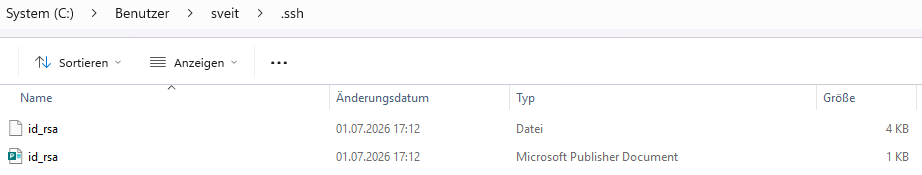

# SSH Key Generation (RSA)

## Overview

SSH key authentication provides a secure alternative to password-based authentication.

This guide explains how to generate an **RSA (4096-bit)** SSH key pair using **OpenSSH** on Windows.

RSA remains widely supported and is primarily used for compatibility with legacy systems that do not support ED25519.

---

## Why Use RSA

RSA is primarily used for compatibility with legacy systems that do not support ED25519.

Typical use cases include:

- Legacy Linux servers
- Older network appliances
- Embedded devices
- Legacy SFTP servers

> **Note**
>
> If your environment supports ED25519, it is generally recommended over RSA due to its smaller keys, faster operations, and modern cryptographic design.

---

## Prerequisites

Before generating an SSH key, ensure that:

- Windows 10 or Windows 11 is installed
- PowerShell is available
- OpenSSH Client is installed (included by default on modern Windows versions)

---

# Step-by-Step Guide

## Step 1 – Verify OpenSSH Installation

Open PowerShell and verify that OpenSSH is installed.

```powershell
ssh -V
```

Expected output:

```text
OpenSSH_for_Windows_...
```

If the command is not recognized, install the optional Windows feature **OpenSSH Client** before continuing.

---

## Step 2 – Generate the RSA Key Pair

Generate a new RSA (4096-bit) SSH key pair.

```powershell
ssh-keygen -t rsa -b 4096
```

Explanation:

- `-t rsa` specifies the RSA algorithm.
- `-b 4096` generates a 4096-bit RSA key.

The command starts the interactive key generation wizard.

---

## Step 3 – Choose the Storage Location

The wizard asks where the key should be stored.

```text
Enter file in which to save the key
(C:\Users\<username>\.ssh\id_rsa):
```

Press **Enter** to use the default location.

Alternatively, specify another filename if multiple SSH keys are required.

---

## Step 4 – Configure an Optional Passphrase

Next, OpenSSH asks for a passphrase.

```text
Enter passphrase (empty for no passphrase):
```

### Without Passphrase

- Convenient
- No additional password required
- Suitable for automated scenarios

### With Passphrase

- Additional protection
- Recommended for production environments
- Requires entering the passphrase whenever the key is used

---

## Step 5 – Verify Successful Key Generation

After completion, OpenSSH displays information similar to:

```text
Your identification has been saved in ...

Your public key has been saved in ...

The key fingerprint is ...
```

This confirms that the RSA key pair has been created successfully.

---

## Step 6 – Verify the Generated Files

Display the contents of the `.ssh` directory.

```powershell
dir $HOME\.ssh
```

Expected output:

```text
id_rsa
id_rsa.pub
```



> **Note**
>
> Depending on your Windows file associations, the `.pub` file may appear as a *Microsoft Publisher Document*. Despite the icon, it is an SSH public key and **not** a Publisher file.

---

## Step 7 – Display the Public Key

Display the public key.

```powershell
Get-Content $HOME\.ssh\id_rsa.pub
```

Example:

```text
ssh-rsa AAAAB3NzaC1yc2EAAAADAQABAAACAQ...
```

Only the **public key** should be shared with remote systems.

---

## Step 8 – Display the Key Fingerprint (Optional)

Display the fingerprint of the generated public key.

```powershell
ssh-keygen -lf $HOME\.ssh\id_rsa.pub
```

Example:

```text
4096 SHA256:xxxxxxxxxxxxxxxxxxxxxxxx
```

Fingerprints uniquely identify SSH keys without exposing the complete public key.

---

# Understanding the Generated Files

After successful generation, the following files exist:

| File | Description |
|------|-------------|
| `id_rsa` | Private key. Keep this file secret and never share it. |
| `id_rsa.pub` | Public key. Upload this file to SSH servers and services. |

---

# Security Considerations

- Never share the private key.
- Protect the private key with appropriate file permissions.
- Consider using a passphrase whenever possible.
- Back up the private key securely.
- Use different key pairs for different environments if appropriate.

---

# Troubleshooting

## ssh-keygen is not recognized

Install the Windows **OpenSSH Client**.

---

## Permission denied

Verify that:

- the correct private key is being used
- the corresponding public key is installed on the remote server

---

## Existing key already present

If `id_rsa` already exists, either:

- overwrite the existing key
- specify another filename during creation

---

# Related Articles

- SSH Key Generation (ED25519)
- Azure Storage Account – Enable SFTP
- Azure Blob Storage – Configure Local Users
- Azure Blob Storage – Upload an SSH Public Key
- WinSCP – Connect to Azure Blob Storage using SFTP
