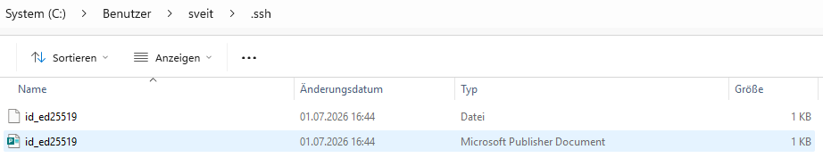

# SSH Key Generation (ED25519)

## Overview

Secure Shell (SSH) uses asymmetric cryptography for secure authentication.

An SSH key pair consists of two files:

- **Private Key** – Stored securely on your local computer and **must never be shared**.
- **Public Key** – Can safely be uploaded to servers or cloud services that support SSH authentication.

When connecting to a remote system, the server verifies that you own the corresponding private key without ever transmitting it over the network.

SSH key authentication is generally considered more secure than password-based authentication.

---

## Prerequisites

Before generating an SSH key pair, ensure that:

- Windows 10 or Windows 11 is installed
- PowerShell is available
- The OpenSSH Client is installed (included by default on modern Windows versions)

---

# Step-by-Step Guide

## Step 1 – Verify the OpenSSH Installation

Check whether the OpenSSH client is installed.

```powershell
ssh -V
```

Expected output:

```text
OpenSSH_for_Windows_...
```

If the command is not recognized, install the optional Windows feature **OpenSSH Client** before continuing.

---

## Step 2 – Generate an ED25519 Key Pair

Generate a new SSH key pair using the recommended ED25519 algorithm.

```powershell
ssh-keygen -t ed25519
```

### Why ED25519?

ED25519 is Microsoft's and OpenSSH's recommended algorithm because it provides:

- High security
- Small key size
- Fast authentication
- Broad compatibility with modern systems

---

## Step 3 – Choose the Storage Location

The wizard prompts for the storage location of the key files.

```text
Enter file in which to save the key
(C:\Users\<username>\.ssh\id_ed25519):
```

Press **Enter** to accept the default location.

---

## Step 4 – Configure a Passphrase

Next, you are prompted to enter a passphrase.

```text
Enter passphrase (empty for no passphrase):
```

### Without a Passphrase

Press **Enter** to leave the passphrase empty.

Advantages:

- Faster authentication
- Convenient for lab and test environments

### With a Passphrase (Recommended)

Protect the private key with an additional password.

Advantages:

- Additional protection if the private key is copied or stolen
- Recommended for production environments

---

## Step 5 – Verify Successful Key Generation

After the key pair has been generated successfully, OpenSSH displays output similar to:

```text
Your identification has been saved in...
Your public key has been saved in...
The key fingerprint is...
```

This confirms that both the private and public key have been created successfully.

---

## Step 6 – Verify the Generated Files

Display the contents of the `.ssh` directory.

```powershell
dir $HOME\.ssh
```

Expected output:

```text
id_ed25519
id_ed25519.pub
```



> **Note**
>
> Depending on your Windows file associations, the `.pub` file may appear as a *Microsoft Publisher Document*. Despite the icon, it is an SSH public key and **not** a Publisher file.

---

## Step 7 – Display the Public Key

Display the contents of the public key.

```powershell
Get-Content $HOME\.ssh\id_ed25519.pub
```

The public key can safely be copied and uploaded to cloud services or servers that support SSH authentication.

---

## Step 8 – Protect the Private Key

The private key can also be displayed.

```powershell
Get-Content $HOME\.ssh\id_ed25519
```

> **Warning**
>
> Never share your private key.
>
> Anyone with access to the private key can authenticate as you.

For this reason, avoid taking screenshots or publishing the contents of the private key.

---

## Step 9 – Display the Key Fingerprint (Optional)

Display the fingerprint of the generated public key.

```powershell
ssh-keygen -lf $HOME\.ssh\id_ed25519.pub
```

Example:

```text
256 SHA256:...
```

The fingerprint uniquely identifies the SSH key and can be used to verify that the correct key is being used.

---

# Security Best Practices

- Never share your private key.
- Only distribute the public key.
- Protect the private key with a passphrase whenever possible.
- Store the private key only on trusted devices.
- Create a secure backup of your private key.

---

# Related Articles

- Azure Storage Account – Enable SFTP
- Azure Blob Storage – Configure Local Users
- Azure Blob Storage – Upload an SSH Public Key
- WinSCP – Connect to Azure Blob Storage using SFTP
