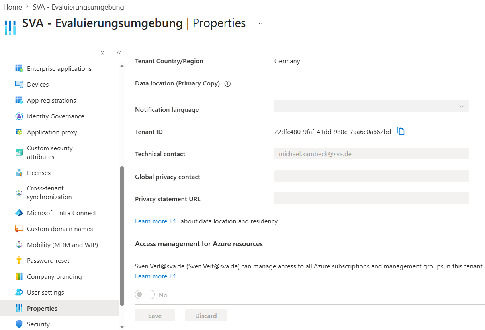
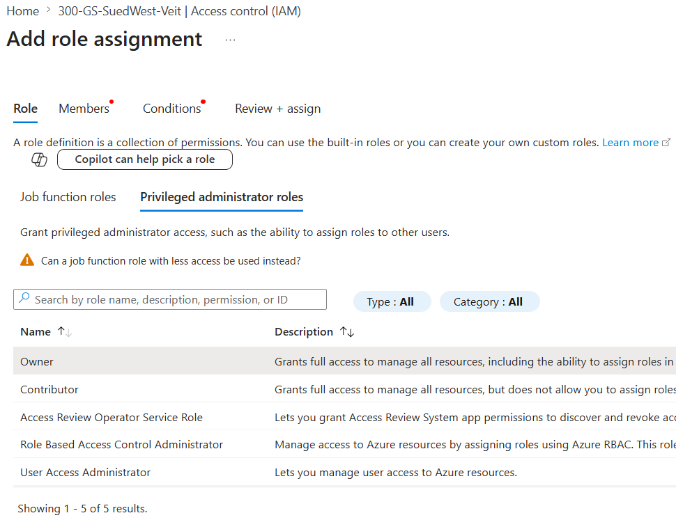

# CSP Subscription – Customer Has No Permissions

## Problem

After provisioning a new Azure CSP subscription, the customer can see the subscription but cannot manage resources.

---

## Symptoms

The customer is unable to:

* Create Resource Groups
* Create Storage Accounts
* Assign Azure RBAC roles
* View or manage permissions in IAM

### Example Error

```text
You do not have permissions to create resource groups under subscription ...
```

or

```text
You do not have permission to view role assignments.
```

---

## Root Cause

Microsoft Entra roles and Azure RBAC roles are separate permission systems.

Being assigned the role:

```text
Global Administrator
```

does **not automatically grant permissions** on Azure subscriptions.

### Example

```text
Microsoft Entra ID
└─ Global Administrator

Azure Subscription
└─ Owner / Contributor / Reader
```

---

## Resolution

### Step 1 – Enable Access Management for Azure Resources

Navigate to:

```text
Microsoft Entra ID
→ Properties
→ Access management for Azure resources
→ Yes
→ Save
```

This grants the Global Administrator temporary elevated permissions at tenant root scope.

### Step 2 – Sign Out and Sign In Again

```text
Logout
→ Login
```

Wait a few minutes if necessary.

### Step 3 – Assign Subscription Permissions

Navigate to:

```text
Subscriptions
→ <Subscription>
→ Access Control (IAM)
→ Add Role Assignment
```

Assign one of the following roles:

```text
Owner
```

or

```text
Contributor
```

depending on customer requirements.

---

## Verification

Navigate to:

```text
Subscription
→ My Permissions
```

Expected result:

```text
Role: Owner
Scope: Subscription
```

The customer should now be able to:

* Create Resource Groups
* Create Azure resources
* View IAM role assignments
* Assign RBAC permissions (Owner only)

---

## CSP Specific Notes

For newly created CSP subscriptions, ownership is often assigned only to the CSP partner.

### Example

```text
Foreign Principal for <Partner Name>
Role: Owner
```

In this scenario either:

* The customer assigns themselves **Owner** permissions using the procedure above
* The CSP partner assigns the customer **Owner** or **Contributor** permissions

---

## Lessons Learned

Always verify customer permissions immediately after CSP subscription provisioning.

### Checklist

* [ ] Customer has Owner permissions
* [ ] Customer can create a Resource Group
* [ ] Customer can create a Storage Account
* [ ] Customer can access IAM
* [ ] Customer can assign RBAC roles (if required)

Perform these checks before starting implementation activities.
